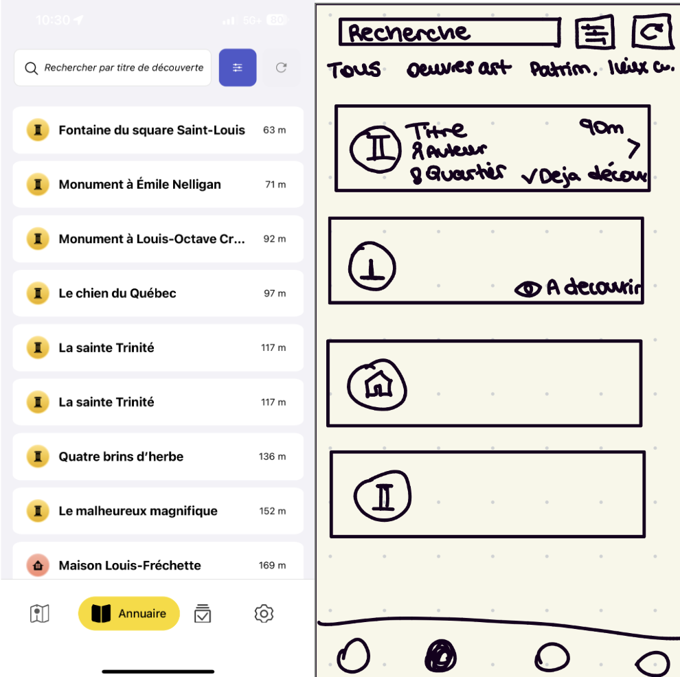
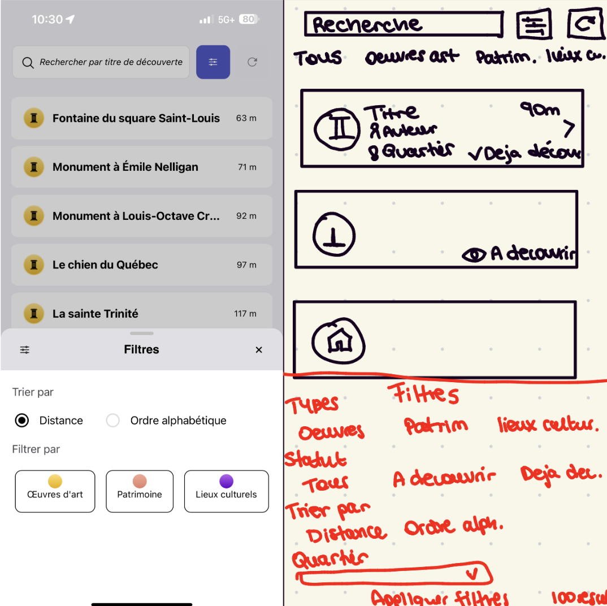
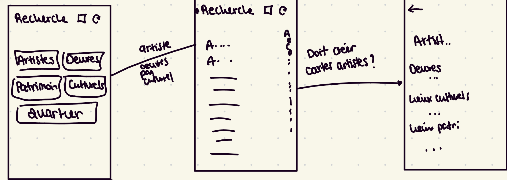
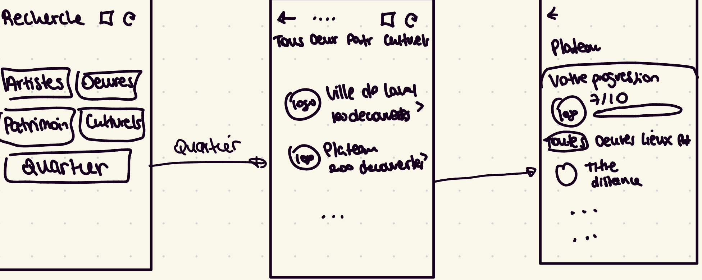
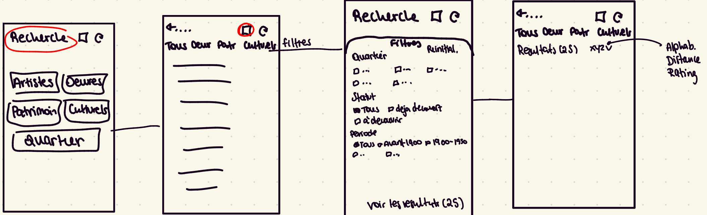

# Suivi de projet

---

## Semaine 1 (7–13 septembre)

### Travail réalisé
- Premier meeting avec Léna
- Prendre connaissance de toutes les plateformes à utiliser
    - Element, l'application MONA

J'ai fait ma premiere recontre avec Léna, qui m'as presenté maison MONA et expliqué le fonctionnement du projet.
Je suis allée a un des parcours proposé par la maison MONA, où on s'est promené dans Outremont pour découvrire les oeuvres d'art public. J'ai pu me familiariser avec l'application; photographier l'art, lire les descriptions, regarder mes photos sauvegardés, et prendre notes de choses que j'aimerais améliorer.

### Notes

!!! Choses pertinantes à mentionner pendant la réunion
    - Lors du tutoriel, on ne peut pas retourner en arrière
    - Peut pas changer la photo de l'oeuvre une fois téléversé dans l'app

## Semaine 2 (14–20 septembre)

### Travail réalisé
- Première réunion avec Anissa, Mariama, Jonathan et Léna
- Commencer mon site web
- Planifier les horaires où je pourrais travailler sur le projet 

Avec le début des cours j'ai consacré 2 plages horaires dans ma semaine pour travailler sur le projet, pendant lesquels j'ai pu commencer mon site web. J'ai aussi eu ma première reunion avec une partie de l'èquipe dev, où on m'as montré un peu le coté serveur de l'application ainsi que le fontionnement des réunions. De plus j'ai pu programmer une réunion pour la semaine prochaine avec Jonathan pour qu'il me montre le travail qu'il a réalisé cet été, ainsi que le fonctionnement du développement mobile chez la maison MONA.

## Semaine 3 (21–26 septembre)

### Travail réalisé
- Réunion avec Jonathan
- Installation de tout les fichiers pour dev

Jonathan a pu me montrer sur quoi il a travaillé cet été; les utilisaeurs recoivent une notification quand ils sont proches d'oeuvres à Montréal pour leur permettre de découvrir l'art autour d'eux, cependant il a implementé cela sur Android ce qui me pousse a voulour travailler sur l'implémentation Apple. Je cherche encore sur quoi faire le centre de mon projet ce semestre, je pense que pour commencer à me familiariser avec le développment je vais rajouter une option "Retour" pour la page tutoriel.  
J'ai eu une réunion avec Christian qui m'as aidé à installé les logiciels et les fichiers dont j'avais besoin, et par la suite j'ai ajouter la fonctionnalité du retour arrière dans le tutoriel de l'application. Cependant au lieu de faire une fléche retour arrière j'ai fait en sorte que lorsqu'on click sur la moitié gauche de l'écran on revient à la page d'avant et la moitié à droite pour passer a la page suivante.

### Notes

!!! Idées pour le projet
    - Notifications IOS
    - Améliorer la recherche dans l'annuaire
    - Améliorer la galerie dans "ma collection", ajouter un filtrage,..

Je pense choisir l'amélioration de la recherche dans l'annuaire avec ces sous-objectifs: 

<ol>
  <li>Repenser l'interface de recherche</li>
  <li>Ajouter plus de filtres (Quartier, type d'oeuvre, artiste, découvert ou pas)</li>
  <li>Ajouter options de tri</li>
  <li>Ajouter un checkbox si c'est découvert ou pas</li>
</ol>

Voici un petit schéma que j'ai fais pour avoir une petite visualisation

## Semaine 4 (28 septembre – 4 octobre)

### Travail réalisé
- Plus de précision sur les taches à accomplir pour le projet
- Benchmark
- Rendu la zone invitant l’utilisateur à prendre une photo cliquable

J'ai eu une reunion avec l'equipe tech de la maison MONA(Léna, alix, Jonathan et Mariama), où j'ai pu leur expliquer mon projet, soit l'amélioration de la recherche. Léna m'as donné quelques idées que je pourrais ajouter a mon implémentation; lier les badges à la recherche, utiliser Mobbin pour benchmark d'autres applications qui ont une page de recherche. 
J'ai donc passé un après-midi sur le benchmark et de bien définir tout ce que je vais rajouter a la recherche;
Au niveau de la recherche:
<ol>
  <li>Ajouter la recherche par artiste (il va falloir créer des cartes pour chaque artiste)</li>
  <li>Permettre à l'utilisateur de faire des typos</li>
</ol>

Au niveau de l'interface:
<ol>
  <li>Première page, on peut choisir d'explorer les artistes, oeuvres d'art, lieux patrimoniaux, lieux culturels ou quartier</li>
  <ul>
    <li>Si on choisi artiste ou une découverte(oeuvres d'art, lieux patrimoniaux, lieux culturels) on a une liste avec barre alphabétique a droite</li>
    
    <li>Si on choisi quartier, on a une page où on peut choisir un quartier avec le nombre de découvertes à cote, quand on choisi un quartier spécifique on a notre progression -/10 et toutes les découvertes</li>
    
    <li>Si on choisi de rechercher, et ensuite les filtres qui sont: quartier, statut, période et le nombre de résultats s'affiche en dessous. Ensuite on peut chosiir de les trier par distance, ordre alphabétique ou par rating</li>
    
  </ul>
</ol>
Ensuite j'ai contacté Mariama qui s'occupe du coté serveur donc qui connait bien les données qu'on recoit de m'envoyer une liste des informations qu'on a sur chaque découverte qui arrive chez nous pour trouver d'autres filtres que je pourrais ajouter.

En parallèle, j'ai rendu une zone contenant une illustration qui invite l'utilisatuer de prendre une photo cliquable, l'utilisateur pourra cliquer sur le bouton "Photographier" ou directement sur la zone.
